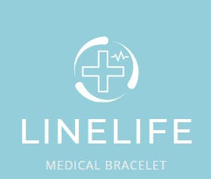

# LineLife

  

Una Pulsera invaluable que puede salvar vidas en situaciones de
emergencia. Al proporcionar acceso instantáneo a información
médica crítica, la pulsera permite a los paramédicos tomar
decisiones informadas y brindar una atención más rápida y eficaz.
Además, la pulsera también contribuye a mejorar la seguridad
pública mediante el análisis de datos de accidentes y la
identificación de áreas problemáticas usando Inteligencia artificial

En situaciones de emergencia, cada segundo cuenta. Cuando una
persona sufre un accidente y se encuentra inconsciente, la falta de
acceso inmediato a información médica crucial puede tener
consecuencias devastadoras. Para abordar este problema,
presentamos una Pulsera que utiliza tecnología NFC para
proporcionar a los paramédicos y personal de emergencia acceso
instantáneo a datos médicos vitales, como tipo de sangre, alergias
y medicamentos actuales.
La Pulsera es un dispositivo discreto y resistente al agua que se
lleva en la muñeca. Contiene un chip NFC que almacena
información médica personal del usuario, incluyendo:  
● Nombre  
● Edad  
● Sexo  
● Fecha de nacimiento  
● Peso  
● Padecimientos cronicos  
● Tipo de sangre  
● Alergias  
● Medicamentos actuales  
● Información de contactos de emergencia  

### Creado por Angel Ruben 
#### Version 2 creado con NodeJs y MongoDB
